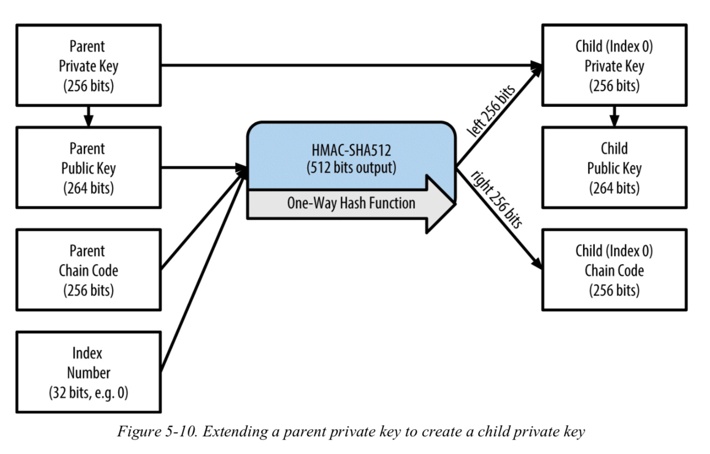
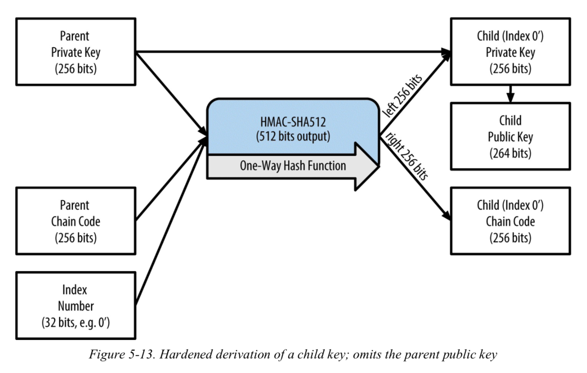
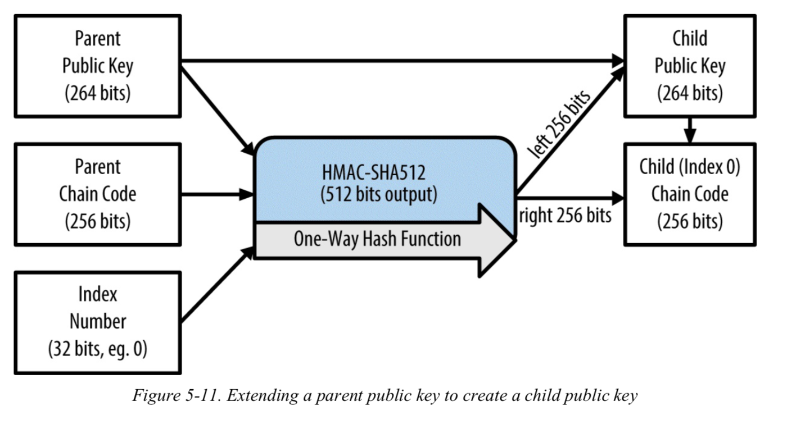
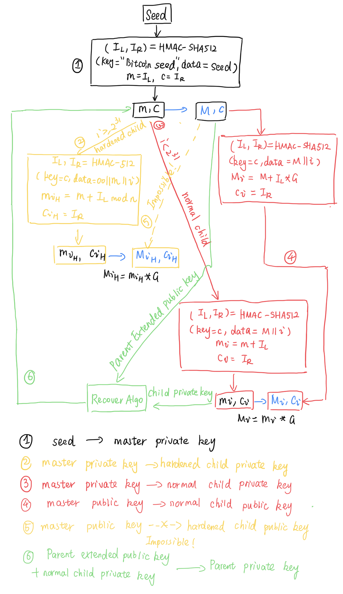
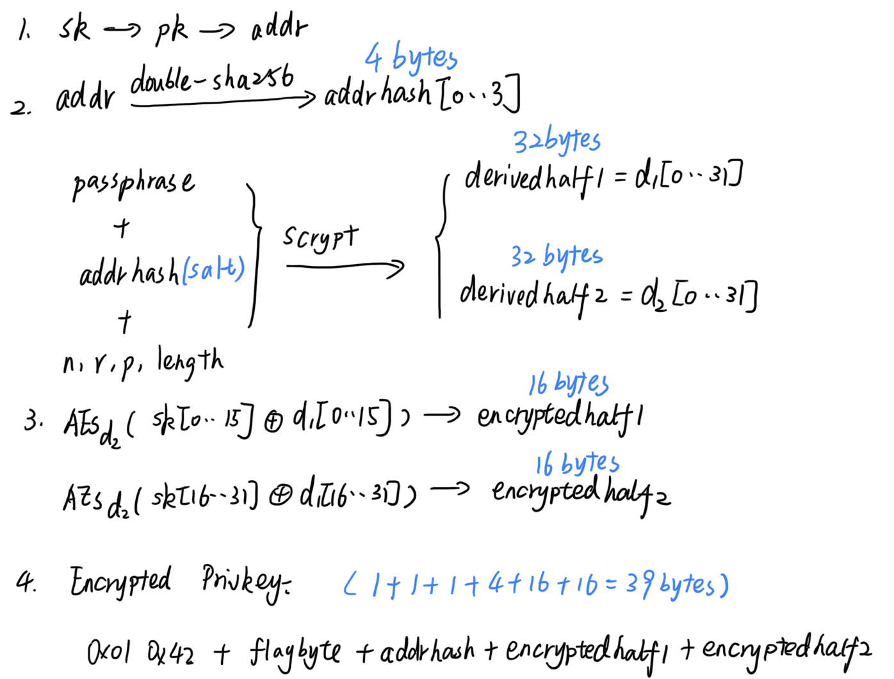
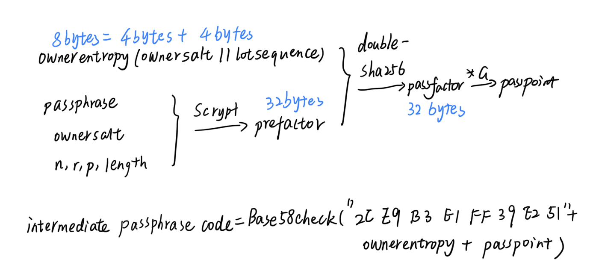
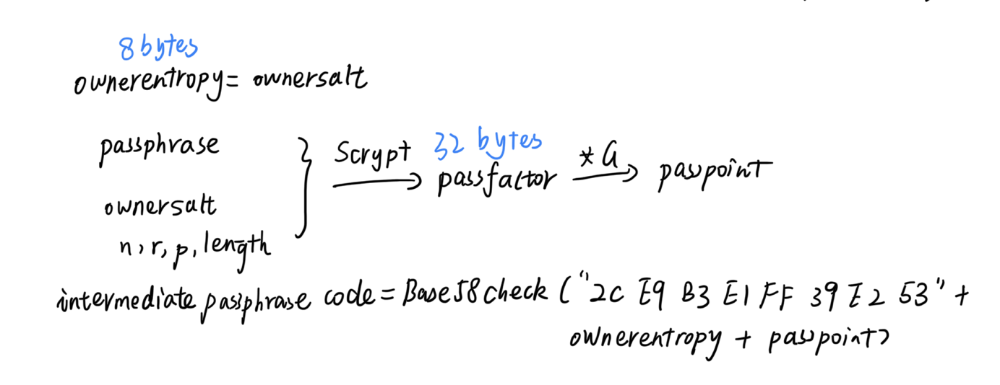

#Something related to key

Yin Jia, yin.jia@bitmain.com  
2018-12-08

在比特币系统中，私钥代表着对比特币的完全控制，用户在发送交易时需要直接与私钥打交道。但由于私钥本身是一串256比特的二进制串，直接以二进制形式访问私钥对用户来说非常不友好。为了方便用户记录和识别，私钥衍生出了Hex,WIF,WIF-compressed等不同形式，它们与256bit二进制串相比长度更短，易于辨别。但由于一个地址就对应了一对公私钥，这些零散的公私钥管理起来十分不便，给用户使用带来了困难。

为了更好地对于私钥进行保护和管理，以及优化用户体验，BIP中一些协议对此进行了探索：BIP32提出了分层确定性钱包的概念，允许用户从一个seed确定性地派生出一棵密钥树，方便在不同钱包客户端之间进行切换，并使得公私钥的派生过程可以独立进行。BIP39则给出了seed的生成方法，并且允许将该seed与一组助记词对应起来，方便用户理解和记忆。BIP38针对私钥的安全性，提出了对私钥进行加密保护的方法，与之前相比，用户只需要多记忆一个passphrase，同时获得了更高的安全性。

上述的BIP协议主要是在如何简化用户与钱包软件的交互、以及在不过多增加用户负担的情况下提高安全性等方面进行的探索，主要是希望由用户掌握一个较短的、方便记忆的字符串，通过密码学的方法，派生出不同用途的密钥（签名、加密）。因此这些方案中除了基本的加密（AES)，签名（ECDSA)算法之外，用到的另外一类算法就是Password-based Key Derivation Function（PBKDF）。下面首先会对涉及到的PBKDF做简要介绍，然后逐一说明每个BIP的原理、功能。
## Password-based Key Derivation Function
Password-based Key Derivation Function用来从一个较短的便于记忆的password派生出密码学方案中使用的密钥，通常在password之外还有一些其他参数如salt，iteration count等。这类函数通常是computationally intensive，即需要的计算量较大。对于合法用户，每次操作只需进行一次派生计算，因此计算量是可以忽略的。而对暴力攻击，攻击者可能需要执行上亿次计算，因此它大幅增加了攻击者的计算难度。并且此类算法支持随着计算机硬件的发展做对计算难度进行灵活的调整，使用起来十分方便。
### PBKDF2
PBKDF2全称为Password-Based Key Derivation Function2，在PKCS#5中作为推荐的密钥派生函数。BIP39协议使用该函数从助记词组派生一个随机串，该随机串用作BIP32 HD钱包中生成主密钥对的seed。  

>PBKDF2最早被包含在PKCS#5（Public Key Cryptography Standard #5: Password-Based Cryptography Specification）中发表，后来该规范又被IETF以RFC 2898重新发表。它取代了输出长度不大于160bit的PBKDF1作为该规范的推荐函数。在2017年发布的RFC8018中，仍然建议用它来做password hashing.

PBKDF2的定义如下，它包含五个输入参数：
> DK = PBKDF2(PRF, Password, Salt, c, dkLen)  

>* PRF is a pseudorandom function of two parameters with output length hLen (e.g., a keyed HMAC)
>* Password is the master password from which a derived key is generated
>* Salt is a sequence of bits, known as a cryptographic salt
>* c is the number of iterations desired
>* dkLen is the desired bit-length of the derived key
>* DK is the generated derived key

在PBKDF中，由于用户的passphrase取值空间一般较小，攻击者在进行暴力攻击时比较容易。Salt作为一段均匀随机分布的比特串，不需要保密，目的是为了增加攻击者的搜索空间。同时当salt足够长时（如64bit），攻击者无法通过预计算存储相应的计算结果，从而降低了攻击的可行性。

PBKDF2的计算过程如下：
>
>* If $dkLen > (2^{32} - 1) * hLen$, output "derived key too long" and stop.
>* Let l be the number of hLen-octet blocks in the derived key, rounding up, and let r be the number of octets in the last block:

>> $ l=\lceil (dklen/hlen) \rceil $  
>> $r=dklen -(l-1)*hlen$

>* For each block of the derived key apply the function F defined below to the password P, the salt S, the iteration count c, and the block index to compute the block:

>> $T_1=F(P,S,c,1)$
>> $T_2=F(P,S,c,2)$
>> $\cdots$
>> $T_l=F(P,S,c,l)$  
> where F is defined as:
>> $F(P,S,c,i)=U_1 \oplus U_2  \cdots \oplus U_c$  
> and   
>> $U_1=PRF(P,S||INT(i))$  
>> $U_2=PRF(P,U_1)$  
>> $\cdots$  
>> $U_c=PRF(P,U_{c-1})$  
> Here, $INT (i)$ is a four-octet encoding of the integer i, most significant octet first.  
>
>* Concatenate the blocks and extract the first dkLen octets to produce a derived key DK:   
 
>> $DK=T_1||T_2||\cdots|| T_L<0,\cdots r-1>$
>
>* Output the derived key DK.
>

#### Scrypt算法
Scrypt算法由Colin Percival设计，与PBKDF2相比，该算法在执行时对内存的消耗较高，限制了利用硬件并行实现来划分搜索空间从而降低暴力攻击复杂度的可行性，以此来抵抗大规模的专用硬件攻击（即使用ASIC来加速暴力攻击的计算过程）。BIP38协议使用Scrypt算法作为密钥派生函数，从passphrase派生AES的加密密钥。 
 
* Scrypt算法定义如下：

> DK = Scrypt(Passphrase, Salt, N, r, p, dkLen)  

>* Passphrase, the password string.
>* Salt, a sequence of bits, known as a cryptographic salt.
>* N, CPU/Memory cost parameter, must be larger than 1, a power of 2, and less than $2^{(128 * r / 8)}$.
> * r, Block size parameter.
> * p, Parallelization parameter, a positive integer less than or equal to $((2^{32}-1) * hLen) / MFLen$ where hLen is 32 and MFlen is 128 * r.
> * dklen, Intended output length in octets of the derived key; a positive integer less than or equal to $(2^{32} - 1)$ * hLen where hLen is 32.

用户可以根据当前CPU、内存的发展情况、以及要求的并行度对N，r，p参数进行调节，从而调整算法对CPU/内存的消耗。

> Steps:

>* Initialize an array B consisting of p blocks of 128 * r octets each:

>   $B[0]||B[1]||\cdots B[p-1]=PBKDF2-HMAC-SHA256(P,S,1,p*128*r)$
>
>* for i=0 to p-1 do：  
>   $B[i]= scryptROMix(r,B[i],N) $   
> end for  
> * $DK=PBKDF2-HMAC-SHA256(P,B[0]||B[1]||\cdots B[p-1],1,dklen)$

其中，scryptROMix算法用来产生一个expensive-cost 的salt，Scrypt算法对内存的消耗即来源于它。在执行时，它会产生一组长度为N的伪随机比特串（如下，V[i]），同时以一种伪随机的顺序对该比特串进行访问，这就导致攻击者必须有足够的内存来存储它。并且该比特串的计算是比较费时的，因此攻击者经过对时间和空间进行权衡的结果，要么是对内存资源要求不高但运行很慢，要么是效率较高但内存消耗较大。
> B'=scryptROMix(r,B,N)

> * r, Block size parameter.
> * B, Input octet vector of length 128 * r octets.
> * N, CPU/Memory cost parameter, must be larger than 1, a power of 2, and less than $2^(128 * r / 8)$.
> * B', Output octet vector of length 128 * r octets.
> 
> Steps:

> * X = B
> * for i = 0 to N - 1 do  
>   $V[i]=X$  
>   $X=scryptBlockMix(X)$  
> end for   
> 
> * for i=0 to N-1 do    
> $j=Integerify(X)$ mod $N$  
> $T=X \oplus V[j]$  
> $X=scryptBlockMix(T)$  
> end for
> 
> * $B'=X$

scryptBlockMix算法如下：
> $B'[0]||B'[1]||\cdots B'[2*r-1]=scryptBlockMix(B[0]||B[1]||\cdots B[2*r-1],r)$

> * r, Block size parameter
> * $B[0]||B[1]||\cdots B[2*r-1]$, Input octet string (of size 128 * r octets), treated as 2 * r 64-octet blocks, where each element in B is a 64-octet block.
> * $B'[0]||B'[1]||\cdots B'[2*r-1]$, output octet string.

> Steps:

> * $X = B[2*r-1]$
> * for $i = 0$ to $2*r - 1$ do    
> $T=X \oplus B[i]$  
>$X=Salsa(T)$  
> end for   
> * $B'=(Y[0],Y[2],\cdots,Y[2*r-2],
> 		Y[1],Y[3],\cdots, Y[2*r-1])$

Salsa20/8是Salsa20 Core轮函数的缩减版本，算法如下：

```
#define R(a,b) (((a) << (b)) | ((a) >> (32 - (b)))) 
void salsa20_word_specification(uint32 out[16],uint32 in[16]) 
{

	int i; 
	uint32 x[16]; 
	for (i = 0;i < 16;++i) x[i] = in[i]; 
	for (i = 8;i > 0;i -= 2) { 
		x[ 4] ^= R(x[ 0]+x[12], 7); x[ 8] ^= R(x[ 4]+x[ 0], 9);
		x[12] ^= R(x[ 8]+x[ 4],13); x[ 0] ^= R(x[12]+x[ 8],18); 
		x[ 9] ^= R(x[ 5]+x[ 1], 7); x[13] ^= R(x[ 9]+x[ 5], 9); 
		x[ 1] ^= R(x[13]+x[ 9],13); x[ 5] ^= R(x[ 1]+x[13],18); 
		x[14] ^= R(x[10]+x[ 6], 7); x[ 2] ^= R(x[14]+x[10], 9); 
		x[ 6] ^= R(x[ 2]+x[14],13); x[10] ^= R(x[ 6]+x[ 2],18); 
		x[ 3] ^= R(x[15]+x[11], 7); x[ 7] ^= R(x[ 3]+x[15], 9); 
		x[11] ^= R(x[ 7]+x[ 3],13); x[15] ^= R(x[11]+x[ 7],18); 
		x[ 1] ^= R(x[ 0]+x[ 3], 7); x[ 2] ^= R(x[ 1]+x[ 0], 9); 
		x[ 3] ^= R(x[ 2]+x[ 1],13); x[ 0] ^= R(x[ 3]+x[ 2],18); 
		x[ 6] ^= R(x[ 5]+x[ 4], 7); x[ 7] ^= R(x[ 6]+x[ 5], 9); 
		x[ 4] ^= R(x[ 7]+x[ 6],13); x[ 5] ^= R(x[ 4]+x[ 7],18); 
		x[11] ^= R(x[10]+x[ 9], 7); x[ 8] ^= R(x[11]+x[10], 9); 
		x[ 9] ^= R(x[ 8]+x[11],13); x[10] ^= R(x[ 9]+x[ 8],18); 
		x[12] ^= R(x[15]+x[14], 7); x[13] ^= R(x[12]+x[15], 9); 
		x[14] ^= R(x[13]+x[12],13); x[15] ^= R(x[14]+x[13],18);

	}
 	for (i = 0;i < 16;++i) out[i] = x[i] + in[i];

}

```


##Hierarchical Deterministic Wallets(BIP32,BIP44)


出于隐私性的考虑，中本聪在比特币的白皮书中建议： **A new key pair should be used for each transaction to keep them
from being linked to a common owner.** 为了防止每次交易后都需要对新生成的公私钥进行备份，钱包客户端需要维护一个预留的密钥池。这种方式给用户在不同客户端之间进行切换、以及钱包对用户私钥的管理带来了困难：在切换时，用户需要导出/导入所有相关地址的私钥，并且不能在不同的系统上同时使用钱包。分层确定性钱包从根节点确定性派生密钥树的方法很好地解决了这个问题。

分层确定性(HD)钱包是由Pieter Wuille在2012年于BIP32中提出的，在该协议下，钱包从根节点出发，按照层级结构以一种确定性的方式从parent key 派生 child key，从而建立起一棵由根节点完全派生的树。因此，当用户在两个支持该协议的不同客户端之间进行切换时，密钥的导入、导出只需要复制根节点（主密钥）的信息，钱包可以根据根节点和该协议规定的派生方法确定性地派生出整棵密钥树。因此，用户可以方便地在不同客户端之间切换，钱包也可以依据密钥的派生层级对密钥进行逻辑上的分层管理。
  
此外，该协议允许child private/public key的派生过程相互独立，即parent private key 可以派生出 child private/public key，而parent public key只能派生出 child public key。它保证了在不安全的环境中，在没有parent private key 访问权限的情况下也可以进行child public key的派生，防止父私钥的泄露。同时，钱包的树状结构有助于用户对访问权限进行选择性的共享（**这取决于共享的密钥所处的层级，以及共享的是私钥还是公钥**）。  

由于[BIP32](https://github.com/bitcoin/bips/blob/33e040b7bdf5d937599d2401454878d6293476c9/bip-0032.mediawiki)着重讲述分层确定性钱包的原理，对于客户端如何实现并没有做严格的限制，因此，2014年，Marek Palatinus和Pavol Rusnak 提出了[BIP44](https://github.com/bitcoin/bips/blob/master/bip-0044.mediawiki)，在BIP32的基础上对钱包具体的实现方式、 不同层级的逻辑含义进行了规定。目前已经支持BIP44的钱包有Mycelium Bitcoin Wallet，Copay， CoinVault，Samourai，Coinomi，Trezor，Keepkey，Ledger Wallet，21 Machine Wallet， Trust Wallet。  

###密钥派生

####扩展密钥
* 在使用该协议从父节点派生子节点时，实际上使用的是512比特的扩展密钥(k,c)/(K,c)，其中k代表私钥，K代表公钥，c则称为chain code，作为额外的256比特的熵。对于扩展公私钥对，其中只有公私钥部分不同，chain code是相同的。
* 每一个扩展密钥都有最多$2^{31}$个 normal child key和$2^{31}$个hardened child key， normal child key对应的index从0到$2^{31}-1$，hardened child key的index 则从$2^{31}$ 到$2^{32}-1$，为便于表示，对于hardened key的index，$i+2^{31}$记为 $i_H$。Hardened node引入的目的是为了增强整个方案的安全性，具体原理在Security一节会详细介绍。下面首先介绍从父节点到子节点的密钥派生过程。


####Private Parent Key -> Private Child Key
 
* Normal child 的派生过程（图片来自《Master Bitcoin》）：


* Hardened child 的派生过程（图片来自《Master Bitcoin》）：


> The function $CKDpriv((k_{par}, c_{par}), i)$ -> $(k
_i, c_i)$ computes a child extended private key from the parent extended private key:

> * Check whether $i ≥ 2^{31}$ (whether the child is a hardened key).  

>>* If so (hardened child): let I = HMAC-SHA512($Key = c_{par}$, Data = 0x00 || $ser_{256}(k_{par}$) || $ser_{32}$(i)). (Note: The 0x00 pads the private key to make it 33 bytes long.)  

>>* If not (normal child): let I = HMAC-SHA512(Key = $c_{par}$, Data = $ser_P$(point($k_{par}$)) || $ser_{32}$(i)).  
>
>* Split I into two 32-byte sequences, $I_L$ and $I_R$.  
>
>* The returned child key $k_i$ is $parse_{256}(I_L)$ + $k_{par}$ (mod n).
>
>* The returned chain code $c_i$ is $I_R$.  
>
>* In case parse256($I_L$) ≥ n or $k_i = 0$, the resulting key is invalid, and one should proceed with the next value for i. (Note: this has probability lower than 1 in $2^{127}$.)  
>

* 需要注意的是，对于hardened child node和normal child node的派生方法是有区别的：
* 在派生private normal child key 时，首先使用父节点的私钥计算出对应的公钥后（即$point(k_{par}$)），将公钥与child的index `i` 级联后作为data，父节点的chain code作为key，一起送入HMAC-SHA512进行运算。而hardened child node 则使用0x00 || $ser_{256}(k_{par}$) || $ser_{32}$(i)作为HMAC-SHA512的data，这也就导致了hardened child 只能由private parent key来派生（无论是计算child private key还是public child key）。


#### Public Parent Key -> Public Child Key
* 派生过程如下：
（图片来自《Master Bitcoin》）

> The function $CKDpub((K_{par}, c_{par}), i) -> (K_i, c_i)$ computes a child extended public key from the parent extended public key. It is only defined for non-hardened child keys.

> Check whether $i ≥ 2^{31}$ (whether the child is a hardened key).
>>If so (hardened child): return failure  
>>If not (normal child): let I = HMAC-SHA512($Key = c_{par}, Data = ser_P(K_{par})$ || $ser_{32}(i)$).

>Split I into two 32-byte sequences, $I_L$ and $I_R$.  
>The returned child key $K_i$ is point($parse_{256}(I_L)$) + $K_{par}$.  
>The returned chain code $c_i$ is $I_R$.  
>In case $parse_{256}(I_L$) ≥ n or $K_i$ is the point at infinity, the resulting key is invalid, and one should proceed with the next value for i.

* 对比上一个从private parent key派生private child key的过程，在由public parent key派生public child key时，HMAC-SHA512计算结果的前256比特$I_L$首先映射到椭圆曲线群上的一个点（通过倍乘运算）后，才与public parent key相加。
* **椭圆曲线群上加法与模n加法（n是椭圆曲线群上基点G的阶数）的同态性，保证了按照这种方式派生出的公钥跟上面同一index派生出的私钥是一一对应的。**这也就是在计算normal child key时，private child key和public child key的派生可以相互独立的原因。

> 对于一个基于$F_p$的椭圆曲线群，假设基点为G，阶数为n。存在一个从$Z_n$到$E(F_p)$上的映射$f(x)=x*G$,且该映射$f$是保持加法操作的：
> > 即对于$Z_n$上的任意值$x$, $\Delta_x \in Z_n$ 有：$f(x+\Delta_x)=f(x)+f(\Delta_x)$。   
> 
> 这里的x就相当于上面的parent private key，$\Delta_x$就相当于HMAC-SHA512输出的$I_L$，f即为从私钥计算相应公钥的过程。这也就是说，将私钥$x$先加上一个偏移量$\Delta_x$，再通过f变换得到的结果，与先将私钥x和偏移$\Delta_x$映射到公钥，再做加法得到的结果是相同的。

#### Private Parent Key-> Public Child Key
* 有两种方式来进行派生：

> $N(CKDpriv((k_{par}, c_{par}), i))$ (works always).  
> $CKDpub(N(k_{par}, c_{par}), i)$ (works only for non-hardened child keys).  
> 其中，$N((k, c)) -> (K, c)$表示从扩展私钥计算相应的扩展公钥。

* 我们之前提到，在计算hardened child key时，无论是public key 还是private key，都只能由private parent key 来派生。因此，第二种计算方式只针对normal节点有效。

#### Public Parent Key -> Private Child Key
* This is impossible!

### The Key Tree
* 有了以上的派生方法，我们就可以从一个根节点出发，一层一层地派生出一棵密钥树来。这个根节点通常被称为扩展主密钥，BIP32中规定了相应的主密钥派生方法：

#### 主密钥派生

>Master keys are not generated directly, but instead from a potentially short seed value.

>* Generate a seed byte sequence S of a chosen length (between 128 and 512 bits; 256 bits is advised) from a (P)RNG.
>* Calculate I = HMAC-SHA512(Key = "Bitcoin seed", Data = S)
>* Split I into two 32-byte sequences, $I_L$ and $I_R$.
>* Use $parse_{256}(I_L)$ as master secret key, and $I_R$ as master chain code.
 
* 有了主密钥m之后，可以遍历所有的index，按照迭代的方式往下派生密钥树。
* 总派生图如下（其中绿色部分的Recover算法会在Security一节详细介绍）：


#### Logic Hierarchy for Determined Wallets in BIP44

* 为了方便标记，将CKDpriv(CKDpriv(CKDpriv(m,$3_H$),2),5) 记为 $m/3_H/2/5$，将CKDpub(CKDpub(CKDpub(M,3),2),5) 记为 $M/3/2/5$。其中m代表主私钥，M代表主公钥。
* BIP44对确定性钱包的逻辑层次做了如下限定：

> m / purpose' / coin_type' / account' / change / address-index

* 其中，`'`代表了这一层使用的是hardened child的派生方式。
* Purpose被设定为一个常量44‘(0x8000002C)，代表了这棵树的逻辑层级是符合BIP44规范的。
* Coin type： 对每个不同的数字货币建立了独立的子树空间，避免了不同货币之间的地址重用。对于每种数字货币，coin type是一个常量，需要开发者为他们的项目申请尚未使用的值。
* Account： 根据不同的用户身份以及使用目的对密钥空间进行划分，允许钱包将不同账户隔离开来。Account从0 开始递增。**在当前账户没有任何交易历史的情况下，钱包软件需要阻止新账户的生成，并且在用户从外部导入种子(master seed)后，钱包需要恢复所有已经使用过的账户**。
* Change: `0`代表外部的密钥链，即需要暴露给其他人用来收款的地址。`1`代表内部的密钥链，对于外部是不可见的，如用作找零地址等。
* Index: 地址从0开始连续递增，该index即为BIP32中定义的用于派生子节点的child index。

#####Examples

Coin   | Account | Chain | Address | Path 
-------| --------|-------|---------|------
Bitcoin| first   | external | first | m/44'/0'/0'/0/0 
Bitcoin| first   | change | first | m/44'/0'/0'/1/0 
Bitcoin Testnet| second|external|second|m/44'/1'/1'/0/1
Bitcoin Testnet| second|change|first|m/44'/1'/1'/1/0

#### Account Discovery
用户从外部导入master seed后，钱包需要对用户使用过的账户进行恢复，过程如下：

>* Derive the first account's node (index = 0)
>* Derive the external chain node of this account
>* Scan addresses of the external chain; respect the gap limit described below
>* If no transactions are found on the external chain, stop discovery
>* If there are some transactions, increase the account index and go to step 1

* Gap limit目前被设置为20，即当扫描到某个账户k的external chain里有连续20个没有被使用的地址时，钱包就会认为当前的账户还没有被使用，就停止继续扫描。
* 该算法有效的前提是，**存在账户没有被使用时，钱包需要阻止用户通过递增index继续生成下一个新账户，并且在同一个账户内部，存在20个连续的地址没有被使用时，阻止用户跨越这些地址生成下一个新地址**。


### Security
#### 该方案能够提供的安全性如下：

* 给定一个公钥K，攻击者计算出相应私钥k的难度至少和解决椭圆曲线离散对数问题一样难（这是由基于椭圆曲线的密码学方案所提供的）。
* 给定一个extended private key$(k_i,c_i)$以及对应的$i$，攻击者恢复parent private key $k_{par}$至少和对HMAC-SHA512进行暴力攻击一样难，即至少需要进行$2^{256}$次HMAC-SHA512计算。
* 给定任意数量（$2\leq N\leq 2^{32}-1$）的(index,extended private key)对($i_j,(k_j,c_j)$)，确定他们是否是由同一个parent extended private key 派生出来的，至少和对HMAC-SHA512进行暴力攻击一样难，即至少需要进行$2^{256}$次HMAC-SHA512计算。

#### 以下两种场景是不安全的：

* 给定一个parent extended public key$(K_{par},c_{par})$ 和一个normal child public key $(K_i)$，找到该child对应的i是容易的。
> 对于normal child，i的取值范围为$0$~$2^{31}-1$，给定上述条件，可以通过遍历i来重复child public key 派生的过程，并比较派生出的public key是否与给定的child public key相等，如相等，则对应i就是该child对应的index。

* 给定一个parent extended public key $(K_{par},c_{par})$, 和normal child private key $(k_i)$, 找到$k_{par}$是容易的。
>* 推导过程如下：
>* 根据前一部分的推导，可以计算出该child对应的index i。  
>* 由于I = HMAC-SHA512(Key = $c_{par}$, Data = $ser_P$($K_{par}$) || $ser_{32}$(i))=($I_L,I_R)$, 而 $k_i$=($parse_{256}(I_L)$) + $k_{par}$ $(mod$ $n)$.   
>* 因此 $k_{par}$=$k_i-$($parse_{256}(I_L)$)$(mod$ $n)$    
* 第二条性质对于安全性的影响比较关键。这意味着知道一个parent extended public key + private non-hardened child key即意味着知道了parent extended private key，因此对待extended public key 应该比普通的public key 更加小心。
* 而对于hardened 节点，因为它们只能由parent extended private key来派生，所以安全性相对较好一些（不存在上述问题），这也是在BIP44中规定在`purpose, cointype, account`层使用hardened 节点的原因（防止这三层上一层的私钥被攻击者按上述过程恢复出来）。

* 当知道了parent extended public key 以及 child private key后，parent private key的恢复过程如下：(以下代码基于一个BIP32钱包的Python库[bip32utils](https://github.com/lyndsysimon/bip32utils))

```
CURVE_GEN  = ecdsa.ecdsa.generator_secp256k1
CURVE_ORDER  = CURVE_GEN.order()
BIP32_HARDEN = 0x80000000 
def recover_parent_privkey(parent_pubkey,child_privkey):
	# traverse all possible non-hardened child index (0~2^31-1) to find the corresponding index of child_privkey
	for i in xrange(0, BIP32_HARDEN +1):
		child=parent_pubkey.CKDpub(i)
		if(child.PublicKey()==child_privkey.PublicKey()):
			break
    # if i is larger than 2^31-1, means that it corresponds to a hardened child, then the recovery is impossible
	if i & BIP32_HARDEN:
		print "can not recover parent private key with a hardened child node"
		return
	# data is composed of public key || i
	data=parent_pubkey.PublicKey()+struct.pack(">L",i)
	(Il,Ir)=parent_pubkey.hmac(data)
	Il_int = string_to_int(Il)
	if Il_int > CURVE_ORDER:
	    return None
	cpk_int=string_to_int(child_privkey.k.to_string())
	# recover parent private key ppk_int from cpk_int= ppk_int + Il_int mod n
	ppk_int=(cpk_int-Il_int)%CURVE_ORDER
	return int_to_string(ppk_int).encode('hex')
```

* 按照[BIP32](https://github.com/bitcoin/bips/blob/33e040b7bdf5d937599d2401454878d6293476c9/bip-0032.mediawiki#Test_vector_2)测试向量2中给定的seed，计算出相应路径下的child private/public key，并调用`recover_parent_privkey(m,m/0)`恢复m的私钥，测试结果如下：

```
Test vector 2:
Master (hex): fffcf9f6f3f0edeae7e4e1dedbd8d5d2cfccc9c6c3c0bdbab7b4b1aeaba8a5a29f9c999693908d8a8784817e7b7875726f6c696663605d5a5754514e4b484542
* [Chain m]
 ext pub: xpub661MyMwAqRbcFW31YEwpkMuc5THy2PSt5bDMsktWQcFF8syAmRUapSCGu8ED9W6oDMSgv6Zz8idoc4a6mr8BDzTJY47LJhkJ8UB7WEGuduB
 ext prv: xprv9s21ZrQH143K31xYSDQpPDxsXRTUcvj2iNHm5NUtrGiGG5e2DtALGdso3pGz6ssrdK4PFmM8NSpSBHNqPqm55Qn3LqFtT2emdEXVYsCzC2U
* [Chain m/0]
 ext pub: xpub69H7F5d8KSRgmmdJg2KhpAK8SR3DjMwAdkxj3ZuxV27CprR9LgpeyGmXUbC6wb7ERfvrnKZjXoUmmDznezpbZb7ap6r1D3tgFxHmwMkQTPH
 ext prv: xprv9vHkqa6EV4sPZHYqZznhT2NPtPCjKuDKGY38FBWLvgaDx45zo9WQRUT3dKYnjwih2yJD9mkrocEZXo1ex8G81dwSM1fwqWpWkeS3v86pgKt
* [Chain m/0/2147483647h]
 ext pub: xpub6ASAVgeehLbnwdqV6UKMHVzgqAG8Gr6riv3Fxxpj8ksbH9ebxaEyBLZ85ySDhKiLDBrQSARLq1uNRts8RuJiHjaDMBU4Zn9h8LZNnBC5y4a
 ext prv: xprv9wSp6B7kry3Vj9m1zSnLvN3xH8RdsPP1Mh7fAaR7aRLcQMKTR2vidYEeEg2mUCTAwCd6vnxVrcjfy2kRgVsFawNzmjuHc2YmYRmagcEPdU9
* [Chain m/0/2147483647h/1]
 ext pub: xpub6DF8uhdarytz3FWdA8TvFSvvAh8dP3283MY7p2V4SeE2wyWmG5mg5EwVvmdMVCQcoNJxGoWaU9DCWh89LojfZ537wTfunKau47EL2dhHKon
 ext prv: xprv9zFnWC6h2cLgpmSA46vutJzBcfJ8yaJGg8cX1e5StJh45BBciYTRXSd25UEPVuesF9yog62tGAQtHjXajPPdbRCHuWS6T8XA2ECKADdw4Ef
* [Chain m/0/2147483647h/1/2147483646h]
 ext pub: xpub6ERApfZwUNrhLCkDtcHTcxd75RbzS1ed54G1LkBUHQVHQKqhMkhgbmJbZRkrgZw4koxb5JaHWkY4ALHY2grBGRjaDMzQLcgJvLJuZZvRcEL
 ext prv: xprvA1RpRA33e1JQ7ifknakTFpgNXPmW2YvmhqLQYMmrj4xJXXWYpDPS3xz7iAxn8L39njGVyuoseXzU6rcxFLJ8HFsTjSyQbLYnMpCqE2VbFWc
* [Chain m/0/2147483647h/1/2147483646h/2]
 ext pub: xpub6FnCn6nSzZAw5Tw7cgR9bi15UV96gLZhjDstkXXxvCLsUXBGXPdSnLFbdpq8p9HmGsApME5hQTZ3emM2rnY5agb9rXpVGyy3bdW6EEgAtqt
 ext prv: xprvA2nrNbFZABcdryreWet9Ea4LvTJcGsqrMzxHx98MMrotbir7yrKCEXw7nadnHM8Dq38EGfSh6dqA9QWTyefMLEcBYJUuekgW4BYPJcr9E7j

Recovered parent private key: 4b03d6fc340455b363f51020ad3ecca4f0850280cf436c70c727923f6db46c3e
Successfully recover parent private key!

```
## Mnemonic code for generating deterministic keys(BIP39)
BIP39提出了一种从助记词派生HD钱包seed的方法，使得用户只需要掌握这组助记词即可派生出HD钱包的密钥树，从而优化用户的交互体验。  
该协议主要包含两个过程：1.从entropy生成助记词的过程；2.从助记词派生seed的过程。其中，助记词是从事先定义好的wordlist里选出的符合相应长度要求的单词集合，目前针对英语、日语、韩语、西班牙语、中文（简体/繁体）、法语、意大利语都有相应的wordlist，在使用前都对它们进行UTF-8编码处理，详见[Wordlists](https://github.com/bitcoin/bips/blob/master/bip-0039/bip-0039-wordlists.md)。


### Entropy -> Mnemonic
用来产生助记词的entropy长度范围为128-512bit，但必须是32的整数倍，entropy长度越长，安全性就越高，同时生成助记词的个数也越多。助记词的产生过程如下：

* 假设初始的熵值e的长度为ENT，取`SHA256(e)`的前`ENT/32`bit作为检验和附在e的后面，随后将级联后的比特串按11bit为基本单元进行分组，即每个分组的数字范围是0-2047，将其作为index从wordlist中读取相应的word，最终选出的词语即构成了一个mnemonic sentence。
* 下面的列表展示了初始熵值长度ENT，校验和长度与生成的mnemonic sentence长度之间的关系：


		CS = ENT / 32
		
		MS = (ENT + CS) / 11
		
		|  ENT  | CS | ENT+CS |  MS  |
		-------+----+--------+------+
		|  128  |  4 |   132  |  12  |
		|  160  |  5 |   165  |  15  |
		|  192  |  6 |   198  |  18  |
		|  224  |  7 |   231  |  21  |
		|  256  |  8 |   264  |  24  |


### Mnemonic -> Seed
BIP39规定使用PBKDF2函数来生成seed，PBKDF2各参数设置如下：mnemonic sentence以 UTF-8 NFKD编码后作为password，"mnemonic"联接passphrase同样使用UTF-8 NFKD进行编码后作为salt，c=2048, PRF=HAMC-SHA512, dklen=512。最终该算法输出的512bit作为 seed，使用BIP32或其他类似的算法派生HD wallet。


### 测试

以下测试基于Trezor的一个python实现库[python-mnemonic](https://github.com/trezor/python-mnemonic)：

```
def main():
    import binascii
    import sys
    from bip32utils import BIP32Key
    if len(sys.argv) > 1:
        data = sys.argv[1]
    else:
        data = sys.stdin.readline().strip()
    data = binascii.unhexlify(data)
    m = Mnemonic('english')
    code=m.to_mnemonic(data)
    seed=m.to_seed(code,'TREZOR')
    xprv = BIP32Key.fromEntropy(seed).ExtendedKey()
    print('mnemonic : %s (%d words)' % (code, len(code.split(' '))))
    print('seed     : %s (%d bits)' % (binascii.hexlify(seed),len(seed) * 4))
    print('xprv     : %s' % xprv)

```

测试结果：

```
BJ1806200001:mnemonic bitmain$ python mnemonic.py f585c11aec520db57dd353c69554b21a89b20fb0650966fa0a9d6f74fd989d8f

mnemonic : void come effort suffer camp survey warrior heavy shoot primary clutch crush open amazing screen patrol group space point ten exist slush involve unfold (24 words)
seed     : 01f5bced59dec48e362f2c45b5de68b9fd6c92c6634f44d6d40aab69056506f0e35524a518034ddc1192e1dacd32c1ed3eaa3c3b131c88ed8e7e54c49a5d0998 (256 bits)
xprv     : xprv9s21ZrQH143K39rnQJknpH1WEPFJrzmAqqasiDcVrNuk926oizzJDDQkdiTvNPr2FYDYzWgiMiC63YmfPAa2oPyNB23r2g7d1yiK6WpqaQS

``` 


## Passphrase-protected private key(BIP38)
BIP38提出了一种使用passphrase对私钥进行加密保护的方案。该方案只考虑了针对私钥的机密性保护，而没有考虑提供完整性保护，因此其主要针对纸钱包和physical Bitcoin等私钥密文不容易遭受篡改的应用场景。该协议主要提出了两种加密私钥的方法，其中一种方法使用了EC 乘法操作，另一种没有，从而导致两种方法实现的功能有很大的区别：

* Encryption when EC multiply is not used: 对于已经产生的私钥，使用用户设置的passphrase对私钥进行加密。加密后的密文与passphrase在解密私钥时缺一不可，由于两者可以独立存储、传输，从而提高了私钥的安全性。
* Encryption when EC multiply is used: 用户首先会生成一个intermediate passphrase code（包含一个由passphrase单向生成的椭圆曲线群上的点，以及用户产生的salt），并将其传输给一个第三方（由于该方案针对的场景主要是纸钱包，这里的第三方通常是一个printer），第三方可以为用户生成新的地址，并对恢复该地址对应私钥的必要信息加密后展示给用户。用户拿到密文解密后，结合passphrase，即可算出新地址对应的私钥。这种方式允许用户将生成新地址的工作委托给一个不那么可信的第三方来做，同时保证只有知道passphrase和密文的人才能计算出对应私钥。


### 编码格式
针对两种私钥加密方式，对私钥加密保护后的数据编码格式略有不同，但长度都是39字节。对于不使用EC乘法的，最终的数据由对`0x01 0x42+ flagbyte+ addrhash+ encryptedhalf1 + encryptedhalf2`进行Base58Check编码后的数据构成。而对于使用EC乘法的，加密保护后的私钥数据由`0x01 0x43+ flagbyte+ addrhash+ ownerentropy+ encryptedhalf1 + encryptedhalf2`进行Base58Check编码后的数据构成（具体含义会在后面详细介绍）。

`0x01 0x42/43`是为了使经过Base58Check编码后的结果以`6P`开头，`6`代表了`a private key that needs something else to be usable`，`P`代表了上一句中的`something is a passphrase`。

flagbyte为1字节，最高两位用来区分是否使用EC乘法：`11`表示不使用EC乘法，反之设置为`00`。`0x20`用来表示私钥转换成比特币地址时使用的是压缩公钥的格式。`0x40`的用来表示在使用EC乘法时，同时也使用了lot+sequence，这两个数字的作用会在后面说明。`0x10,0x08`予以保留。

Addrhash为对比特币地址进行两次SHA256操作后，取前四个字节的结果。

### Encryption when EC multiply is not used
该方法对已知的私钥进行加密，加密过程分为两部分：从passphrase使用Scrypt派生AES加密的密钥；使用AES对私钥信息进行加密。


> Encryption steps:

>* Compute the Bitcoin address (ASCII), and take the first four bytes of SHA256(SHA256()) of it. Let's call this "addresshash".

>* Derive a key from the passphrase using scrypt  
>>* Parameters: passphrase is the passphrase itself encoded in UTF-8 and normalized using Unicode Normalization Form C (NFC). salt is addresshash from the earlier step, n=16384, r=8, p=8, length=64 (n, r, p are provisional and subject to consensus)  
>>* Let's split the resulting 64 bytes in half, and call them derivedhalf1 and derivedhalf2.  

>* Do AES256Encrypt(block = bitcoinprivkey[0...15] xor derivedhalf1[0...15], key = derivedhalf2), call the 16-byte result encryptedhalf1  
>* Do AES256Encrypt(block = bitcoinprivkey[16...31] xor derivedhalf1[16...31], key = derivedhalf2), call the 16-byte result encryptedhalf2  

>* The encrypted private key is the Base58Check-encoded concatenation of the following, which totals 39 bytes without Base58 checksum:
0x01 0x42 + flagbyte + salt + encryptedhalf1 + encryptedhalf2



* 在使用Scrypt派生密钥时，Scrypt参数中salt设置为比特币地址经过double-SHA256后的前4个字节。该字段无需保密，目的是为了增加攻击者进行暴力破解时的搜索空间，增加攻击的时间/空间复杂度。


 解密过程首先根据用户掌握的passphrase计算出AES的解密密钥，随后对密文解密：

> Decryption steps:

>* Collect encrypted private key and passphrase from user.  
>* Derive derivedhalf1 and derivedhalf2 by passing the passphrase and addresshash into scrypt function.  
>* Decrypt encryptedhalf1 and encryptedhalf2 using AES256Decrypt, merge them to form the encrypted private key.  
>* Convert that private key into a Bitcoin address, honoring the compression preference specified in flagbyte of the encrypted key record.  
>* Hash the Bitcoin address, and verify that addresshash from the encrypted private key record matches the hash. If not, report that the passphrase entry was incorrect.  

### Encryption when EC multiply is used

该方法利用了EC 乘法的同态性质，主要思想类似于一个基于椭圆曲线的密钥协商方案：用户事先由passphrase和entropy等生成一个随机数x，并计算对应的椭圆曲线群上的点$P=x*G$，将其发给第三方。随后，第三方选择一个随机数k与该点进行EC的乘法操作，即视为新生成的公钥$P'=k*P=(x \cdot k)*G$。随后将k加密后发送给用户（加密过程与上一个方法类似）。用户收到数据解密后，计算出新私钥$x\cdot k$。假设用于生成x的passphrase被保护的足够好，那么用户就可以确认新私钥是足够安全的（只有掌握passphrase的人才能计算），这一点可以认为是使用该方法生成新的加密私钥所额外带来的一个安全性方面的好处。
该算法包含两个阶段：初始化阶段、私钥生成阶段。
#### 初始化
初始化阶段主要功能是用户由passphrase+ownerentrpy计算intermediate passphrase code，并发送给第三方。  

在计算时，用户可以选择性的生成一个20bit的lot number和12bit的sequence number。在用户向第三方请求大量的加密私钥时，需要检查返回的私钥对应的lot和sequence number是否与他所提供的intermediate passphrase code一致，以防止来自第三方的潜在攻击。这4字节lot+sequence number并不是必须的，在两种场景下，初始化阶段稍微不同。 
 
在使用lot+sequence时：  
>Steps performed by owner to generate a single intermediate code, if lot and sequence numbers are being included:  

>* Generate 4 random bytes, call them ownersalt.
>* Encode the lot and sequence numbers as a 4 byte quantity (big-endian): lotnumber * 4096 + sequencenumber. Call these four bytes lotsequence.
>* Concatenate ownersalt + lotsequence and call this ownerentropy.
>* Derive a key from the passphrase using scrypt  
>>* Parameters: passphrase is the passphrase itself encoded in UTF-8 and normalized using Unicode Normalization Form C (NFC). salt is ownersalt. n=16384, r=8, p=8, length=32.
>>* Call the resulting 32 bytes prefactor.
>>* Take SHA256(SHA256(prefactor + ownerentropy)) and call this passfactor. The "+" operator is concatenation.  

>* Compute the elliptic curve point G * passfactor, and convert the result to compressed notation (33 bytes). Call this passpoint. Compressed notation is used for this purpose regardless of whether the intent is to create Bitcoin addresses with or without compressed public keys.
>* Convey ownersalt and passpoint to the party generating the keys, along with a checksum to ensure integrity.    
>>* The following Base58Check-encoded format is recommended for this purpose: magic bytes "2C E9 B3 E1 FF 39 E2 51" followed by ownerentropy, and then passpoint. The resulting string will start with the word "passphrase" due to the constant bytes, will be 72 characters in length, and encodes 49 bytes (8 bytes constant + 8 bytes ownerentropy + 33 bytes passpoint). The checksum is handled in the Base58Check encoding. The resulting string is called `intermediate_passphrase_string`.



不使用lot+sequence时：
>* ownersalt is 8 random bytes instead of 4, and lotsequence is omitted. ownerentropy becomes an alias for ownersalt.
>* The SHA256 conversion of prefactor to passfactor is omitted. Instead, the output of scrypt is used directly as passfactor.
>* The magic bytes are "2C E9 B3 E1 FF 39 E2 53" instead (the last byte is 0x53 instead of 0x51).
>



#### 加密私钥计算
第三方拿到intermediate passphrase code后，可以用它为用户生成新的加密私钥。确切地说，第三方可以为用户生成新的公钥，并将计算对应私钥的所需的必要信息进行加密，同时拥有passphrase和该密文人才能从中计算出对应的私钥。  
计算过程如下：
>* Set flagbyte.      
>>* Turn on bit 0x20 if the Bitcoin address will be formed by hashing the compressed public key (optional, saves space, but many Bitcoin implementations aren't compatible with it)
>>* Turn on bit 0x04 if ownerentropy contains a value for lotsequence. (While it has no effect on the keypair generation process, the decryption process needs this flag to know how to process ownerentropy)  

>* Generate 24 random bytes, call this seedb. Take SHA256(SHA256(seedb)) to yield 32 bytes, call this factorb.
>* ECMultiply passpoint by factorb. Use the resulting EC point as a public key and hash it into a Bitcoin address using either compressed or uncompressed public key methodology (specify which methodology is used inside flagbyte). This is the generated Bitcoin address, call it generatedaddress.

以上完成了新公钥（passpoint*factorb）的生成过程。以下过程即是加密过程，与encryption when EC multiply is not used的过程类似。即由passpoint和salt派生AES的加密密钥，然后对新公钥对应私钥的部分信息(seedb)进行加密。

>* Take the first four bytes of SHA256(SHA256(generatedaddress)) and call it addresshash.
>* Now we will encrypt seedb. Derive a second key from passpoint using scrypt  
>>* Parameters: *passphrase* is passpoint provided from the first party (expressed in binary as 33 bytes). *salt* is addresshash + ownerentropy, n=1024, r=1, p=1, length=64. The "+" operator is concatenation.
>>* Split the result into two 32-byte halves and call them derivedhalf1 and derivedhalf2.


>* Do AES256Encrypt(block = (seedb[0...15] xor derivedhalf1[0...15]), key = derivedhalf2), call the 16-byte result encryptedpart1
>* Do AES256Encrypt(block = ((encryptedpart1[8...15] + seedb[16...23]) xor derivedhalf1[16...31]), key = derivedhalf2), call the 16-byte result encryptedpart2. The "+" operator is concatenation.

> The encrypted private key is the Base58Check-encoded concatenation of the following, which totals 39 bytes without Base58 checksum:    

>* 0x01 0x43 + flagbyte + addresshash + ownerentropy +  encryptedpart1[0...7] + encryptedpart2

这里最终数据的格式略有些奇怪，猜想是为了与不使用EC乘法的结果长度保持一致。相比较，这里比前面多了一个8字节的`ownerentroy`字段，因此选取的seedb长度也就限制在了24字节。


#### 恢复新私钥
从第三方返回的密文计算新私钥的过程如下（通常也是由客户端替用户计算的）：

>* Collect encrypted private key and passphrase from user.
>* Derive passfactor using scrypt with ownersalt and the user's passphrase and use it to recompute passpoint
>* Derive decryption key for seedb using scrypt with passpoint, addresshash, and ownerentropy
>* Decrypt encryptedpart2 using AES256Decrypt to yield the last 8 bytes of seedb and the last 8 bytes of encryptedpart1.
>* Decrypt encryptedpart1 to yield the remainder of seedb.
>* Use seedb to compute factorb.

以上过程完成了从密文中恢复seedb，以及从seedb计算factorb的过程。由于新公钥为$passpoint\cdot factorb=passfactor\cdot factorb *G$，对应的私钥即为$passfactor\cdot factorb$。

>* Multiply passfactor by factorb mod N to yield the private key associated with generatedaddress.
>* Convert that private key into a Bitcoin address, honoring the compression preference specified in the encrypted key.
>* Hash the Bitcoin address, and verify that addresshash from the encrypted private key record matches the hash. If not, report that the passphrase entry was incorrect.

在恢复了新私钥后，客户端还需要验证计算出的私钥与之前addresshash给出的地址是否对应，如果不是，则需要向用户返回错误信息，即用户输入了错误的passphrase。（由于该协议描述的目的场景是针对纸钱包，所以可以假定上述编码后的密文的完整性是可以保证的，不会被篡改。）

#### Confirmation Code
在printer为用户生成新的加密后的私钥后，用户当时可能并不需要进行解密（私钥只有在花费对应地址的UTXO时才需要），但他需要对产生的新地址进行确认，以防自己使用的地址对应的私钥并不是自己可计算的。因此，对于使用EC multiply加密私钥的方式，该协议还设计了一个独立的验证方式，即printer可以向用户返回一个以“cfrm38”开头的75个字符的*confirmation code*，用来协助用户验证新地址是否是自己可计算的。
 
Confirmation code生成过程如下：
>To generate it, we need flagbyte, ownerentropy, factorb, derivedhalf1 and derivedhalf2 from the original encryption operation.

>* ECMultiply factorb by G, call the result pointb. The result is 33 bytes.
>* The first byte is 0x02 or 0x03. XOR it by (derivedhalf2[31] & 0x01), call the resulting byte pointbprefix.
>* Do AES256Encrypt(block = (pointb[1...16] xor derivedhalf1[0...15]), key = derivedhalf2) and call the result pointbx1.
>* Do AES256Encrypt(block = (pointb[17...32] xor derivedhalf1[16...31]), key = derivedhalf2) and call the result pointbx2.
>* Concatenate pointbprefix + pointbx1 + pointbx2 (total 33 bytes) and call the result encryptedpointb.  

>The result is a Base58Check-encoded concatenation of the following:  

>* 0x64 0x3B 0xF6 0xA8 0x9A + flagbyte + addresshash + ownerentropy + encryptedpointb

除了常数部分，Confirmation code与私钥密文数据的不同之处在于encryptedpointb，其中包含了$factor*G$的信息，允许用户收到confirmation code后计算出地址，进行两次SHA256后去前四个字节与addresshash进行比对验证。如果验证通过，用户可以使用该地址进行交易，且可以在进行花费时再解密相应私钥。

验证过程如下：
>* Derive passfactor using scrypt with ownerentropy and the user's passphrase and use it to recompute passpoint
>* Derive decryption key for pointb using scrypt with passpoint, addresshash, and ownerentropy
>* Decrypt encryptedpointb to yield pointb
>* ECMultiply pointb by passfactor. Use the resulting EC point as a public key and hash it into address using either compressed or 
uncompressed public key methodology as specifid in flagbyte.

#### Security issues

* Confirmation code存在一个安全隐患：仅仅靠4bytes的addresshash来关联confirmation code和encrypted key是不够的。一个不诚实的printer可以提供两个不同的factorb，同时它们能够产生经过double-sha256后前32bit相同的两个地址。这时，仅仅验证confirmation code是不能够保证用户一定能够计算出他使用的地址所对应的私钥的。这也就是说，confirmation code并不能起到他所声称的作用。

> 比如，printer计算出seedb1以及相应的factorb1，并计算出新私钥对应的地址addr1、$addrhash1=SHA256(SHA256(addr1))_{4bytes}$。由于addrhash只有4字节，他可以遍历factorb的取值，直到找到addrhash2=addrhash1的factorb2（**计算复杂度并不高，生日攻击界为$O(2^{16})$）?**。这时，他就可以根据seedb1来计算encrypted key，根据factorb2来构造confirmation code，并且encrypted key和confirmation code中的addrhash是相同的。之后，将confirmation code和encrypted key发给用户。用户验证confirmation code可以通过，并使用其中计算出的addr2来收款，但是他无法计算出addr2对应的私钥（用户只知道factorb2*G的值），他从encrypted key中计算出来的私钥对应于 factorb1 * passfactor，所以addr2中的钱将无法被花费。

* 在新私钥的生成中，存在一个安全隐患：在同一个intermediate passphrase code下，如果printer知道了其中一个加密私钥的明文，那么它就可以绕开用户的passphrase，得到在当前intermediate passphrase code下派生的所有私钥。
  
> 对于intermediate passphrase code ipc1，printer生成了一个随机数seedb1，按照以上计算（EC multiply used），生成的新私钥应该是 k1=passfactor * factorb1 mod n, factorb1=SHA256(SHA256(seedb1))。假如printer知道了该私钥k1，他就可以计算$passfactor=k1 * factorb1^{-1}$ $mod$ $n$， 因此，在同一个ipc1下的所有私钥都可以被printer计算出来。  
> 这种场景是存在的：如用户委托printer为自己生成新的加密私钥后，不小心又委托他对该私钥按照本协议第一种方法（with no EC multiply）进行加密，恶意的printer可以检测到该私钥是它之前按照第二种方法生成的（对比公钥或地址），这时它就具备了以上攻击的条件。

* lot+sequence的作用并不突出，与ownersalt在计算时起着相同的作用，不理解单独把lot+sequence提出来作为一个防攻击的点来讲，并对两种情况下passpoint的计算进行区分的意义。

#### Test code
下面是用python编写的测试代码：

```
import hashlib 
import secrets
from Crypto.Cipher import AES
import base58check
import scrypt
from bitcoinlib.keys import *
import ecdsa
from ecdsa.curves import SECP256k1
from ecdsa.ecdsa import int_to_string, string_to_int

# parameter for Scrypt function
SCRYPT_N=16384
SCRYPT_R=8
SCRYPT_P=8


def b58check(data):
	# return base58 encoding of data with checksum
	checksum=hashlib.sha256(data).digest()
	checksum=hashlib.sha256(checksum).digest()
	data+=checksum[:4]
	return base58check.b58encode(data)

```

* Encryption & Decryption with no EC multiplication

```
def enc_without_ec_multi(privkey,address,passphrase,compressed):
	# compute addrhash of corresponding address to known private key
	addrhash=hashlib.sha256(address).digest()
	addrhash=hashlib.sha256(addrhash).digest()
	addrhash=addrhash[:4]
	# derive encryption key for AES
	passphrase=passphrase.decode('utf-8')
	d=scrypt.hash(passphrase,addrhash,SCRYPT_N,SCRYPT_R,SCRYPT_P,64)
	derivedhalf1=d[:32]
	derivedhalf2=d[32:64]
	# encryption process
	m1=[a^b for a,b in zip(privkey[:16],derivedhalf1[:16])]
	m2=[a^b for a,b in zip(privkey[16:32],derivedhalf1[16:32])]
	e1=AES.new(derivedhalf2).encrypt(bytes(m1))
	e2=AES.new(derivedhalf2).encrypt(bytes(m2))
   # pack encryption data
	flagbyte=b'\xe0' if compressed==1 else b'\xC0'
	res=b'\x01\x42'+flagbyte+addrhash+e1+e2
	return b58check(res)


def dec_without_ec_multi(encrypted_privkey,passphrase):
	# unpack data 
	data=base58check.b58decode(encrypted_privkey)
	addrhash_v=data[3:7]
	passphrase=passphrase.decode('utf-8')
	# derive decryption key for AES
	d=scrypt.hash(passphrase,addrhash_v,SCRYPT_N,SCRYPT_R,SCRYPT_P,64)
	derivedhalf1=d[:32]
	derivedhalf2=d[32:64]
	# decryption process
	m1=AES.new(derivedhalf2).decrypt(data[7:23])
	m2=AES.new(derivedhalf2).decrypt(data[23:39])
	privkey1=bytes([a^b for a,b in zip(m1,derivedhalf1[:16])])
	privkey2=bytes([a^b for a,b in zip(m2,derivedhalf1[16:32])])
	privkey=privkey1+privkey2
	# verify whether addrhash is correct
	k=Key(privkey)
	addr=k.address_uncompressed() if data[2]==0xC0 else k.address()
	addrhash=hashlib.sha256(addr.encode('ascii')).digest()
	addrhash=hashlib.sha256(addrhash).digest()
	if addrhash!=addrhash_v:
		assert("address is not valid!")
	else:
		return privkey1+privkey2

```
测试结果如下:

```

Encryption with no EC multiplication:
Privkey is : b'\xcb\xf4\xb9\xf7\x04p\x85k\xb4\xf4\x0f\x80\xb8~\xdb\x90\x86Y\x97\xff\xeem\xf3\x15\xab\x16mq:\xf43\xa5'
Encrypted private key is : b'6PRVWUbkzzsbcVac2qwfssoUJAN1Xhrg6bNk8J7Nzm5H7kxEbn2Nh2ZoGg'

Decryption with no EC multiplication:
Decryption succeed!
Private key is  b'\xcb\xf4\xb9\xf7\x04p\x85k\xb4\xf4\x0f\x80\xb8~\xdb\x90\x86Y\x97\xff\xeem\xf3\x15\xab\x16mq:\xf43\xa5'


```

* Encryption & Decryption with EC mutiplication

```
def init_enc_with_ec_multi(passphrase,ownersalt,lotsequence):
	if len(ownersalt+lotsequence)!=8:
		assert("ownerentropy must be 8 bytes!")
	# derive prefactor from scrypt
	prefactor=scrypt.hash(passphrase,ownersalt,SCRYPT_N,SCRYPT_R,SCRYPT_P,32)
	#derive passpoint & pack intermediate passphrase code
	if len(lotsequence)==0:
		intermediate_passphrase_code=b'\x2C\xE9\xB3\xE1\xFF\x39\xE2\x53'
		intermediate_passphrase_code+=ownersalt
		passfactor=prefactor
		print("ownersalt",ownersalt)
	else:
		intermediate_passphrase_code=b'\x2C\xE9\xB3\xE1\xFF\x39\xE2\x51'+ownersalt+lotsequence
		prefactor+=(ownersalt+lotsequence)
		passfactor=hashlib.sha256(prefactor).digest()
		passfactor=hashlib.sha256(passfactor).digest()
	k=Key(bytes(passfactor))
	passpoint=k.public_compressed_byte
	intermediate_passphrase_code+=passpoint
	return b58check(intermediate_passphrase_code)

def enc_with_ec_multi(intermediate_passphrase_code,flag_lotseq,flag_compr):	
	#unpack intermediate passphrase code
	intermediate_passphrase_code=base58check.b58decode(intermediate_passphrase_code)
	ownerentropy=intermediate_passphrase_code[8:16]
	passpoint=intermediate_passphrase_code[16:49]

	# generate random seedb to derive new public key & address
	seedb=secrets.token_bytes(24)
	factorb=hashlib.sha256(seedb).digest()
	factorb=hashlib.sha256(factorb).digest()
	k=Key(bytes(passpoint))
	(x,y)=k.public_point()
	c=ecdsa.ellipticcurve.CurveFp(SECP256k1.curve.p(),SECP256k1.curve.a(),SECP256k1.curve.b())
	p=ecdsa.ellipticcurve.Point(c,x,y)
	new_point=p.__mul__(string_to_int(factorb))
	k=Key(new_point.x()+new_point.y())
	addr=k.address() if flag_compr==1 else k.address_uncompressed()
	addrhash=hashlib.sha256(base58check.b58decode(addr)).digest()
	addrhash=hashlib.sha256(addrhash).digest()
	addrhash=addrhash[:4]

	# derive encryption key and use AES to encrypt seedb
	salt=addrhash[:4]+ownerentropy
	d=scrypt.hash(passpoint,salt,1024,1,1,64)
	derivedhalf1=d[:32]
	derivedhalf2=d[32:64]
	m1=[a^b for a,b in zip(seedb[:16],derivedhalf1[:16])]
	e1=AES.new(derivedhalf2).encrypt(bytes(m1))
	m2=[a^b for a,b in zip(e1[8:16]+seedb[16:24],derivedhalf1[16:32])]
	e2=AES.new(derivedhalf2).encrypt(bytes(m2))

	# put all together and encode with base58check
	flagbyte=(0x04 if flag_lotseq==1 else 0)^(0x20 if flag_compr==1 else 0)
	flagbyte=b'\x00' if flagbyte==0 else bytes([flagbyte])
	res=b'\x01\x43'+flagbyte+addrhash[:4]+ownerentropy+e1[:8]+e2

	return b58check(res)


def dec_with_ec_multi(passphrase,enc_priv):
	#unpack encrpted private key
	enc_priv=base58check.b58decode(enc_priv)
	flagbyte=enc_priv[2]
	addrhash=enc_priv[3:7]
	ownerentropy=enc_priv[7:15]
	ownersalt=ownerentropy[:4] if flagbyte&0x04!=0 else ownerentropy
		
	# derive passpoint from passphrase
	prefactor=scrypt.hash(passphrase,ownersalt,SCRYPT_N,SCRYPT_R,SCRYPT_P,32)
	if (flagbyte&0x04==0):
		passfactor=prefactor
	else:			
		prefactor+=ownerentropy
		passfactor=hashlib.sha256(prefactor).digest()
		passfactor=hashlib.sha256(passfactor).digest()
	k=Key(bytes(passfactor))
	passpoint=k.public_compressed_byte

	# derive encryption key for AES from passpoint and decrypt
	d=scrypt.hash(passpoint,addrhash+ownerentropy,1024,1,1,64)
	derivedhalf1=d[:32]
	derivedhalf2=d[32:64]
	m2=AES.new(derivedhalf2).decrypt(enc_priv[23:39])
	seedb2=bytes([a^b for a,b in zip(m2,derivedhalf1[16:32])])
	m1=AES.new(derivedhalf2).decrypt(enc_priv[15:23]+seedb2[:8])
	seedb1=bytes([a^b for a,b in zip(m1,derivedhalf1[0:16])])
	seedb=seedb1+seedb2[8:16]

	#derive private key and verifiy validness of it
	factorb=hashlib.sha256(seedb).digest()
	factorb=hashlib.sha256(factorb).digest()
	k=Key(factorb)
	(x,y)=k.public_point()
	c=ecdsa.ellipticcurve.CurveFp(SECP256k1.curve.p(),SECP256k1.curve.a(),SECP256k1.curve.b())
	p=ecdsa.ellipticcurve.Point(c,x,y)
	new_point=p.__mul__(string_to_int(passfactor))
	k=Key(new_point.x()+new_point.y())
	addrhash_v=k.address() if flagbyte&0x20==1 else k.address_uncompressed()
	addrhash_v=hashlib.sha256(base58check.b58decode(addrhash_v)).digest()
	addrhash_v=hashlib.sha256(addrhash_v).digest()
	if addrhash_v[:4]==addrhash:
		return k.wif()
	else:
		assert("privkey is invalid")
```
测试结果:

```

Intialization:
Passphrase :  b'passphraseaB8feaLQDENqCgr4gKZpmf4VoaT6qdjJNJiv7fsKvjqavcJxvuR1hy25aTu5sX'
Entropy : b'O\xcaZ\x97@@\xf0\x01'
Intermediate_passphrase_code is  b'passphraseaB8feaLQDENqCgr4gKZpmf4VoaT6qdjJNJiv7fsKvjqavcJxvuR1hy25aTu5sX'

Encryption:
Under this intermediate_passphrase_code, encrypted key is :
b'6PgKDE6dzgJ3cM1Z2fwdhxGyH3W59H1kZjCDHuETevCjCWDh6H7j95X6EF'

Decryption:
Decrypted key plaintext is:
L41y9jwBDLa1h2nHxNnhKGCtn7MDEpMNNvrd1o3WTuoXN8srsrD9

```
