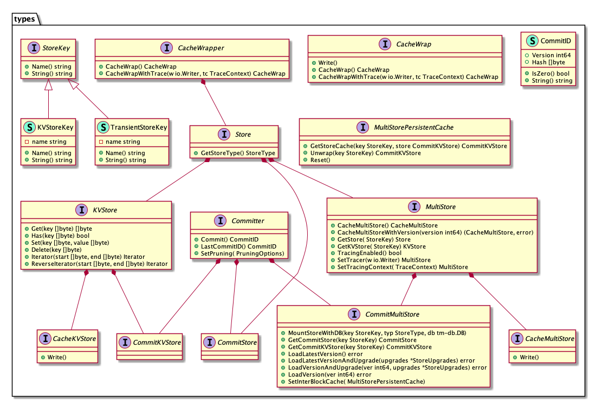

# COSMOS-SDK中的存储实现

longcpp @ 20200424

为了实现数据的持久化存储, comos-sdk/store路径下实现了一些列的存储类型. 默认情况下, 对于基于cosmos-sdk构建的上层应用来说, 最主要的存储类型是`multistore`, 其中可以根据应用需要存储任意个数的存储器. `multistore`的这种设计是为了支持cosmos-sdk的模块化设计, 以便使得应用的每个模块都可以拥有并且独自管理自己的存储空间, 其中这部分独有的存储空间需要通过一个特定的前缀`key`来访问, 这个`key`通常由模块自身的`keeper`持有并且不对外暴露, 由此可以保证本模块的存储空间不会被其他模块修改.

## 存储器-`Store`

cosmos-sdk中全局采用了缓存包装(cache-wrapping), 并且要求所有的存储器都实现相应策略. 缓存包装的基本理念是创建关于一个存储器的轻快照(light snapshot), 这个轻快照可以在不影响底层的存储器状态的情况下被传递和更新. 这种设计在区块链项目中很常见, 这是由于区块链业务属性决定的. 由交易触发的链上状态的转换可能成功也可能不成功, 并且在不成功的时候快速撤销所有的更改操作. 有了轻快照,前述的目的容易达成.并且当执行成功的时候, 被更新过的轻快照可以写入底层的存储器中.

` comos-sdk/store/types/storge.go` 路径下跟存储器相关的类型之间的关系在下面的图中展示. 本质上cosmos-sdk中的存储器是一个实现了 `GetStoreType()` 并且持有`CacheWrapper`的实体`Store`. `CacheWrapper`是接口类型, 其中指明了缓存包装相关的方法以及`Write()`方法(在`CacheWrap`接口中). 



将具体的更改持久化底层数据库中的操作由`Commiter`接口中的`Commit() CommitID`方法提供, `CommitID`是根据状态树通过确定性过程计算出来的, 包含两个字段: 版本号`Version`和哈希值`Hash`. 哈希值`Hash`会返回给底层的共识引擎并存储到区块头中. 将持久化操作分离出来放在单独的接口中也是为了支持cosmos-sdk的 object-capabilities 模型. cosmos-sdk的实现中,只有`baseapp`才应该具备持久化修改底层数据库的能力, 例如在gaia中设置初始状态时`setGenesis`会调用`gapp.Commit()`. 另外的示例则来自于`tendermint`项目中`(*BlockExecutor).ApplyBlock`方法对`Commit`的调用(有多层封装), 此处不再展示.

```go
// gaia v2.0.9 app/app_test.go 38-55
func setGenesis(gapp *GaiaApp) error {

	genesisState := simapp.NewDefaultGenesisState()
	stateBytes, err := codec.MarshalJSONIndent(gapp.cdc, genesisState)
	if err != nil {
		return err
	}

	// Initialize the chain
	gapp.InitChain(
		abci.RequestInitChain{
			Validators:    []abci.ValidatorUpdate{},
			AppStateBytes: stateBytes,
		},
	)
	gapp.Commit()
	return nil
}
```

应用的各个模块对自己模块所拥有的`Store`只能通过`ctx.KVStore()`得到相应的`KVStore`之后,再进行`Get`和`Set`进行读写. 例如cosmos-sdk中的auth模块中, `AccountKeeper`的`GetAccount`和`SetAccount`方法.

```go
// cosmos-sdk v0.34.0 x/auth/keeper/keeper.go 28-36
// GetAccount implements sdk.AccountKeeper.
func (ak AccountKeeper) GetAccount(ctx sdk.Context, addr sdk.AccAddress) exported.Account {
	store := ctx.KVStore(ak.key)
	bz := store.Get(types.AddressStoreKey(addr))
	if bz == nil {
		return nil
	}
	acc := ak.decodeAccount(bz)
	return acc
}

// cosmos-sdk v0.34.0 x/auth/keeper/keeper.go 48-57
// SetAccount implements sdk.AccountKeeper.
func (ak AccountKeeper) SetAccount(ctx sdk.Context, acc exported.Account) {
	addr := acc.GetAddress()
	store := ctx.KVStore(ak.key)
	bz, err := ak.cdc.MarshalBinaryBare(acc)
	if err != nil {
		panic(err)
	}
	store.Set(types.AddressStoreKey(addr), bz)
}
```

## 多重存储器-`Multistore`

每个基于cosmos-sdk构建的应用程序都通过持有一个`MultiStore`来完成状态的持久存储, 由于其重要性在下面列出`MultiStore`接口的完整定义, 其中包含了`Store`接口以及额外的几个方法.

```go
// cosmos-sdk v0.34.0 x/auth/keeper/keeper.go 83-112
type MultiStore interface { //nolint
	Store

	// Cache wrap MultiStore.
	// NOTE: Caller should probably not call .Write() on each, but
	// call CacheMultiStore.Write().
	CacheMultiStore() CacheMultiStore

	// CacheMultiStoreWithVersion cache-wraps the underlying MultiStore where
	// each stored is loaded at a specific version (height).
	CacheMultiStoreWithVersion(version int64) (CacheMultiStore, error)

	// Convenience for fetching substores.
	// If the store does not exist, panics.
	GetStore(StoreKey) Store
	GetKVStore(StoreKey) KVStore

	// TracingEnabled returns if tracing is enabled for the MultiStore.
	TracingEnabled() bool

	// SetTracer sets the tracer for the MultiStore that the underlying
	// stores will utilize to trace operations. The modified MultiStore is
	// returned.
	SetTracer(w io.Writer) MultiStore

	// SetTracingContext sets the tracing context for a MultiStore. It is
	// implied that the caller should update the context when necessary between
	// tracing operations. The modified MultiStore is returned.
	SetTracingContext(TraceContext) MultiStore
}
```

`rootmulti.Store`实现了`MultiStore`接口以及`Committer`接口,  其中的多个存储器通过映射表 `map[types.StoreKey]types.CommitKVStore` 来存储的, 并且借助映射表`map[string]types.StoreKey`和`map[types.StoreKey]storeParams`, `rootmulti.Store`中的每个存储器可以有自己的名字和存储参数.

```go
// cosmos-sdk@v0.34.0 store/rootmulti/store.go 27-43
// Store is composed of many CommitStores. Name contrasts with
// cacheMultiStore which is for cache-wrapping other MultiStores. It implements
// the CommitMultiStore interface.
type Store struct {
	db             dbm.DB
	lastCommitInfo commitInfo
	pruningOpts    types.PruningOptions
	storesParams   map[types.StoreKey]storeParams
	stores         map[types.StoreKey]types.CommitKVStore
	keysByName     map[string]types.StoreKey
	lazyLoading    bool

	traceWriter  io.Writer
	traceContext types.TraceContext

	interBlockCache types.MultiStorePersistentCache
}
```

如前所述, cosmos-sdk中所有的存储器都需要实现缓存策略, `MultiStore`的缓存策略由`cachemulti.Store`实现.

```go
// cosmos-sdk@v0.34.0 store/cachemulti/store.go 17-28
// Store holds many cache-wrapped stores.
// Implements MultiStore.
// NOTE: a Store (and MultiStores in general) should never expose the
// keys for the substores.
type Store struct {
	db     types.CacheKVStore
	stores map[types.StoreKey]types.CacheWrap
	keys   map[string]types.StoreKey

	traceWriter  io.Writer
	traceContext types.TraceContext
}
```

可以利用函数`newCacheMultiStoreFromCMS`从`rootmulti.Store`创建`cachemulti.Store`:

```go
// cosmos-sdk@v0.34.0 store/cachemulti/store.go 68-75
func newCacheMultiStoreFromCMS(cms Store) Store {
	stores := make(map[types.StoreKey]types.CacheWrapper)
	for k, v := range cms.stores {
		stores[k] = v
	}

	return NewFromKVStore(cms.db, stores, nil, cms.traceWriter, cms.traceContext)
}
```

其中`NewFromKVStore`根据输入参数依次初始化`cachemulti.Store`结构体的各个字段(`stores`)只是预留了相应的空间,然后对输入的所有的存储器根据`rootmulti.Store`的`cms.TracingEnabled`的返回值一次调用`store.CacheWrapWithTrace`或者`store.CacheWrap`完成`cachemulti.Store`中`stores`成员的设置.

```go
// cosmos-sdk@v0.34.0 store/cachemulti/store.go 32-56
// NewFromKVStore creates a new Store object from a mapping of store keys to
// CacheWrapper objects and a KVStore as the database. Each CacheWrapper store
// is cache-wrapped.
func NewFromKVStore(
	store types.KVStore, stores map[types.StoreKey]types.CacheWrapper,
	keys map[string]types.StoreKey, traceWriter io.Writer, traceContext types.TraceContext,
) Store {
	cms := Store{
		db:           cachekv.NewStore(store),
		stores:       make(map[types.StoreKey]types.CacheWrap, len(stores)),
		keys:         keys,
		traceWriter:  traceWriter,
		traceContext: traceContext,
	}

	for key, store := range stores {
		if cms.TracingEnabled() {
			cms.stores[key] = store.CacheWrapWithTrace(cms.traceWriter, cms.traceContext)
		} else {
			cms.stores[key] = store.CacheWrap()
		}
	}

	return cms
}
```

`cachemulti.Store`的`Write`方法对针对所有的存储器依次调用`Write`方法. 对比`rootmulti.Store`的相应接口,可以看到`cachemulti.Store`不支持`Commit`接口.

```go
// cosmos-sdk@v0.34.0 store/cachemulti/store.go 110-116
// Write calls Write on each underlying store.
func (cms Store) Write() {
	cms.db.Write()
	for _, store := range cms.stores {
		store.Write()
	}
}
```

另外值得提及的是, 