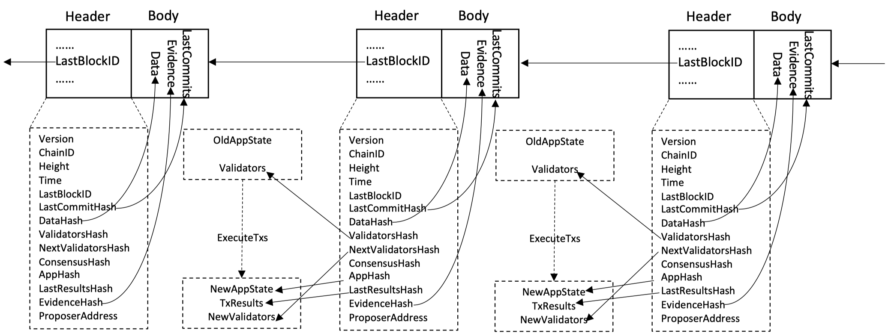

# Tendermint的区块结构


本次来分析Tendermint中的区块结构的设计. 基于Tendermint公式算法的实现的[Tendermint](https://github.com/tendermint/tendermint) 项目包含了P2P网络通信以及Tendermint共识协议两部分的主要功能, 并且通过ABCI接口与上层应用之间进行交互完成交易的处理. Tendermint项目中处理交易时, 不关心交易的具体内容, 仅仅是将交易作为字节数组, 并且通过Tendermint共识协议在所有的验证节点之间对交易顺序(也就是区块中的内容)达成共识. 共识协议的特性以及分层设计的理念,同时影响了Tendermint区块的设计. 

首先回顾[CoinEx Chain的白皮书]()中关于Tendermint共识部分的描述:

>  Tendermint共识协议是半同步的拜占庭共识协议，具有简洁、高效和可追责的特点。共识协议的达成是在已知的验证者集合内完成的，每个验证者通过其公钥进行鉴别。具体的共识过程通过多轮的两阶段（Prevote和Precommit）投票协议以及相应的锁定机制完成。每一轮开始时通过带权重的轮换形式挑选一个验证者为区块提议者（Proposer），由该验证者打包并提议区块，随后验证者就该区块的合法性进行两阶段投票，如果每个阶段都能获得来自多于2/3的验证者的投票则该区块会被提交到链上执行。需要执行多轮的可能原因有：被选中的验证者不在线，提议的区块不合法，在某个投票阶段没有收集到超过2/3的投票信息等等。为了简化对不确定因素的处理，Tendermint中每张投票有两种用途：确认合法信息和确认无效信息。根据投票信息确认当前区块或者进入下一轮，避免了PBFT共识算法中复杂的视图转化协议。可追责的特性则由公钥可鉴别验证者这一约束提供。
>
> 由于CAP定理 [18]的客观存在，Tendermint协议在安全性与可用性之间选择了安全性。也因此Tendermint共识协议有可能会短暂停止直到超过2/3的验证者达成共识。当系统中的恶意的验证者小于1/3时，Tendermint提供了永不分叉的保证。安全性优先于可用性以及永不分叉的承诺对于金融应用至关重要。CoinEx Chain在项目启动时计划支持42个节点，根据Tendermint共识协议的实验数据，在42个节点遍布五大洲的条件下Tendermint能够达到4000TPS的处理速度，能满足去中心化交易所的需求。伴随高TPS的并不是交易确认时间的延长，Tendermint共识机制提供逐区块最终化的特性，能够在秒级完成交易确认。

Tendermint共识协议不分叉承诺以及逐块最终化的特性简化了区块的结构设计和实现, 只需要用哈希指针依次串联起各个区块即可, 无需像比特币一样因为可能的区块回滚而引入复杂的编码, 也无需像Ethereum中考虑链接叔块. 与通常的区块设计一样, Tendermint的区块主要也由区块头和区块体两部分构成. `Block`的定义如下.

```go
// tendermint@v0.33.3 types/block.go 37-44
// Block defines the atomic unit of a Tendermint blockchain.
type Block struct {
	mtx        sync.Mutex
	Header     `json:"header"` // 区块头
	Data       `json:"data"`	 // 区块体
	Evidence   EvidenceData `json:"evidence"`   // 作恶举证
	LastCommit *Commit      `json:"last_commit"`// 
}
```

其中 `Header`和`Data`分别对应区块头和区块体.  `mtx sync.Mutex` 用于区块之中过程中的加锁保护, 而`Evidence   EvidenceData`和`LastCommit *Commit`字段则与Tendermint支持的PoS机制相关. 为了便于理解, 将`Block`相关的类型信息在下图中展示.


`Header`结构体中的基本信息`Version`, `ChainID`,`Height`,`Time`字段分别表示区块的版本号, 链ID, 高度以及生成时间. . 其中`Version`类型`version.Consensus`定义如下. 由于应用层与共识层的为相互独立的两层概念,因此Tendermint应用的版本号需要同时包含区块的版本号`Block`以及应用的版本号`App`, 其中`Protocol`为`uint64`类型的别名. Tendermint中的`Time`类型使用的是[Google Protobuf项目中定义的`Timestamp`类型](https://developers.google.com/protocol-buffers/docs/reference/csharp/class/google/protobuf/well-known-types/timestamp), 该类型中包含2个整型, 1个用来表示秒, 另一个表示纳秒.

```go
// tendermint@v0.33.3 version/version.go 60-66
// Consensus captures the consensus rules for processing a block in the blockchain,
// including all blockchain data structures and the rules of the application's
// state transition machine.
type Consensus struct {
	Block Protocol `json:"block"`
	App   Protocol `json:"app"`
}

```

该区块所指向的上一个区块的唯一标识记录在`LastBlockID`中, 类型为`BlockID`,可以唯一表示一个区块. 结构体`BlockID`中的2个字段均为区块的Merkle树根, 其中`Hash`字段代表区块头中所有字段构成的Merkle树的树根`MerkleRoot(Header)`, 而`PartsHeader`则是关于区块体的Merkle树根. Tendermint中在P2P网络中传播区块体时, 会将序列化后的整个区块分割为小块后再进行广播. 

```go
// tendermint@v0.33.3 types/block.go 892-896
// BlockID defines the unique ID of a block as its Hash and its PartSetHeader
type BlockID struct {
   Hash        tmbytes.HexBytes `json:"hash"`
   PartsHeader PartSetHeader    `json:"parts"`
}

// tendermint@v0.33.3 types/part_set.go 59-62
type PartSetHeader struct {
	Total int              `json:"total"`
	Hash  tmbytes.HexBytes `json:"hash"`
}
```

```go
// 
type Header struct {
	// basic block info

	// hashes of block data
	LastCommitHash tmbytes.HexBytes `json:"last_commit_hash"` // commit from validators from the last block
	DataHash       tmbytes.HexBytes `json:"data_hash"`        // transactions

	// hashes from the app output from the prev block
	ValidatorsHash     tmbytes.HexBytes `json:"validators_hash"`      // validators for the current block
	NextValidatorsHash tmbytes.HexBytes `json:"next_validators_hash"` // validators for the next block
	ConsensusHash      tmbytes.HexBytes `json:"consensus_hash"`       // consensus params for current block
	AppHash            tmbytes.HexBytes `json:"app_hash"`             // state after txs from the previous block
	// root hash of all results from the txs from the previous block
	LastResultsHash tmbytes.HexBytes `json:"last_results_hash"`

	// consensus info
	EvidenceHash    tmbytes.HexBytes `json:"evidence_hash"`    // evidence included in the block
	ProposerAddress Address          `json:"proposer_address"` // original proposer of the block
}
```


Tendermint项目构建的初衷是成为cosmos hub项目的P2P网络层以及共识层. 而Cosmos Hub是基于PoS机制构建的, 由此引入了验证者和提议者的概念. 根据质押的代币数量, 排名靠前的验证者成为活跃验证者, 参与Tendermint共识过程进行投票.



