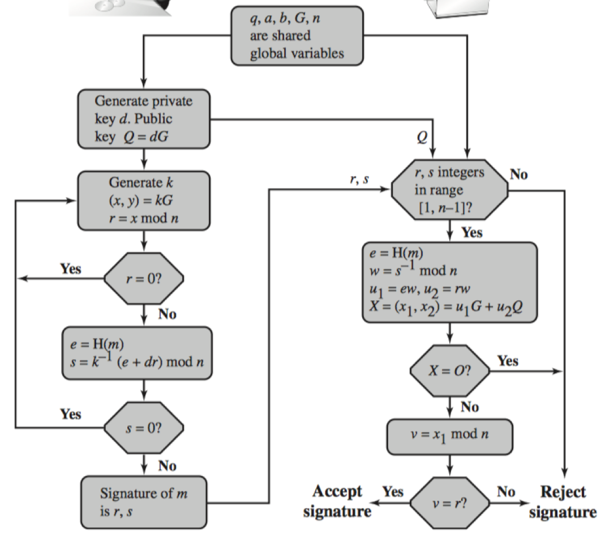

#Lower-S引发的问题


## 问题描述

下面是一个合法的签名数据，但是调用*libsecp256k1*的验签接口时`secp256k1_ecdsa_verify`总是验签失败。

```shell
sig:3046022100e49de3c89180769db346145cdda48323ddecc2af0041293432528767b18407650221009f7878deb054e4f9c0e6aecbe6de15f5d829041c11f7952d33e96c76ada1258b, 
hash:711c17f5edd496d40e53ebde500318d10ddd1257f036228faf6f4186b58601f2, 
pubkey:02dd75eb56481a1be34cbea2dac1ed1b24c703fd42eb210fbc30112df5373ecc11, 
uncompressedPubKey:04dd75eb56481a1be34cbea2dac1ed1b24c703fd42eb210fbc30112df5373ecc11caa0b8e95b7d288ff4e47b5a38f73801e19748f6999de6da94f4f861aa5ab93e
```

## ECDSA图示



## Sage验证签名数据正确性

上述签名数据，遵循ECDSA图示中的符号表示，用*Sage*可表达为

```python

# secp256k1 parameters

field = FiniteField (0xFFFFFFFFFFFFFFFFFFFFFFFFFFFFFFFFFFFFFFFFFFFFFFFFFFFFFFFEFFFFFC2F)
curve = EllipticCurve(field, [0, 7])
G = curve([0x79BE667EF9DCBBAC55A06295CE870B07029BFCDB2DCE28D959F2815B16F81798,0x483ADA7726A3C4655DA4FBFC0E1108A8FD17B448A68554199C47D08FFB10D4B8])
order = FiniteField (curve.order()) # how many points are in our curve
order = FiniteField (0xFFFFFFFFFFFFFFFFFFFFFFFFFFFFFFFEBAAEDCE6AF48A03BBFD25E8CD0364141) # order of secp256k1

x = 0xdd75eb56481a1be34cbea2dac1ed1b24c703fd42eb210fbc30112df5373ecc11
y = 0xcaa0b8e95b7d288ff4e47b5a38f73801e19748f6999de6da94f4f861aa5ab93e
r = 0xe49de3c89180769db346145cdda48323ddecc2af0041293432528767b1840765
s = 0x9f7878deb054e4f9c0e6aecbe6de15f5d829041c11f7952d33e96c76ada1258b
e = 0x711c17f5edd496d40e53ebde500318d10ddd1257f036228faf6f4186b58601f2

x = order(x)
y = order(y)
r = order(r)
s = order(s)
e = order(e)

Q = curve(x,y)
w = s^-1
u1 = e * w
u2 = r * w
X = int(u1) * G + int(u2) * Q

print "x coordinate of X"
print hex(int(X.xy()[0]))
print "r"
print hex(int(r))
print int(X.xy()[0]) == int(r)
print "----"

```
执行结果如下：

```shell
sage: load("lower-s.sage")
x coordinate of X
0xe49de3c89180769db346145cdda48323ddecc2af0041293432528767b1840765L
r
0xe49de3c89180769db346145cdda48323ddecc2af0041293432528767b1840765L
True
----
```

由执行结果可知，所提供的为正确的签名数据。

## libsecp256k1中的约束
以上从数学角度来讲正确的签名数据，调用*libsecp256k1*的验签接口`secp256k1_ecdsa_verify`时总是验签失败。
这是由于*libsecp256k1*中约束，只有**lower-s**才被认为是合法的签名数据。

```c
/** Verify an ECDSA signature.
 *
 *  Returns: 1: correct signature
 *           0: incorrect or unparseable signature
 *  Args:    ctx:       a secp256k1 context object, initialized for verification.
 *  In:      sig:       the signature being verified (cannot be NULL)
 *           msg32:     the 32-byte message hash being verified (cannot be NULL)
 *           pubkey:    pointer to an initialized public key to verify with (cannot be NULL)
 *
 * To avoid accepting malleable signatures, only ECDSA signatures in lower-S
 * form are accepted.
 *
 * If you need to accept ECDSA signatures from sources that do not obey this
 * rule, apply secp256k1_ecdsa_signature_normalize to the signature prior to
 * validation, but be aware that doing so results in malleable signatures.
 *
 * For details, see the comments for that function.
 */
SECP256K1_API SECP256K1_WARN_UNUSED_RESULT int secp256k1_ecdsa_verify(
    const secp256k1_context* ctx,
    const secp256k1_ecdsa_signature *sig,
    const unsigned char *msg32,
    const secp256k1_pubkey *pubkey
) SECP256K1_ARG_NONNULL(1) SECP256K1_ARG_NONNULL(2) SECP256K1_ARG_NONNULL(3) SECP256K1_ARG_NONNULL(4);
```

而所谓的**lower-s**的取值范围在函数接口`secp256k1_ecdsa_signature_normalize`的注释中有指明：

```c
 *  The lower S value is always between 0x1 and
 *  0x7FFFFFFFFFFFFFFFFFFFFFFFFFFFFFFF5D576E7357A4501DDFE92F46681B20A0,
 *  inclusive.
```

所提供的待验签的数据中**s**的值不在这个区间中：

```python
s = 0x9f7878deb054e4f9c0e6aecbe6de15f5d829041c11f7952d33e96c76ada1258b
```

为了使上述待签名数据能够利用*libsecp256k1*验证通过，在验签之前需要先对签名值进行**normalize**。

```c++
#include "libsecp256k1_util.hpp"
#include "secp256k1.h"

#include <algorithm>

int main() {
    const char *sig_str =
        "3046022100e49de3c89180769db346145cdda48323ddecc2af0041293432528767b184"
        "07650221009f7878deb054e4f9c0e6aecbe6de15f5d829041c11f7952d33e96c76ada1"
        "258b";
    const char *hash_str =
        "711c17f5edd496d40e53ebde500318d10ddd1257f036228faf6f4186b58601f2";
    const char *pub_str =
        "04dd75eb56481a1be34cbea2dac1ed1b24c703fd42eb210fbc30112df5373ecc11caa0"
        "b8e95b7d288ff4e47b5a38f73801e19748f6999de6da94f4f861aa5ab93e";

    auto hash = parse_hex(hash_str);
    print_bytes(" hash", hash.begin(), hash.end());

    auto sig_byte = parse_hex(sig_str);
    print_bytes("  sig", sig_byte.begin(), sig_byte.end());

    auto pub_byte = parse_hex(pub_str);
    print_bytes("  pub", pub_byte.begin(), pub_byte.end());

    printf("----\n");

    secp256k1_context *ctx = secp256k1_context_create(SECP256K1_CONTEXT_SIGN |
                                                      SECP256K1_CONTEXT_VERIFY);
    secp256k1_context_set_illegal_callback(ctx, NULL, NULL);
    secp256k1_context_set_error_callback(ctx, NULL, NULL);

    secp256k1_ecdsa_signature sig;
    CHECK(secp256k1_ecdsa_signature_parse_der(ctx, &sig, sig_byte.data(),
                                              sig_byte.size()));

    secp256k1_pubkey pub;
    CHECK(
        secp256k1_ec_pubkey_parse(ctx, &pub, pub_byte.data(), pub_byte.size()));

    unsigned char sig_compact[64];
    CHECK(secp256k1_ecdsa_signature_serialize_compact(ctx, sig_compact, &sig));

    unsigned char pub_uncompressed[65];
    size_t len = 65;
    CHECK(secp256k1_ec_pubkey_serialize(ctx, pub_uncompressed, &len, &pub,
                                        SECP256K1_EC_UNCOMPRESSED));

    print_bytes("     sig", sig_compact, sig_compact + 64);
    print_bytes("sig.data", sig.data, sig.data + 64);
    print_bytes("     pub", pub_uncompressed, pub_uncompressed + 65);
    print_bytes("pub.data", pub.data, pub.data + 64);
    print_bytes("    hash", hash.data(), hash.data() + 32);

    if (secp256k1_ecdsa_verify(ctx, &sig, hash.data(), &pub) != 1)
        printf("WRONG SIGNATURE\n");
    else
        printf("CORRECT SIGNATURE\n");

    printf("----\n");

    // normalize signature
    CHECK(secp256k1_ecdsa_signature_normalize(ctx, &sig, &sig));
    CHECK(secp256k1_ecdsa_signature_serialize_compact(ctx, sig_compact, &sig));

    printf("normalized\n");
    print_bytes("     sig", sig_compact, sig_compact + 64);
    print_bytes("sig.data", sig.data, sig.data + 64);
    print_bytes("     pub", pub_uncompressed, pub_uncompressed + 65);
    print_bytes("pub.data", pub.data, pub.data + 64);
    print_bytes("    hash", hash.data(), hash.data() + 32);

    if (secp256k1_ecdsa_verify(ctx, &sig, hash.data(), &pub) != 1)
        printf("WRONG SIGNATURE\n");
    else
        printf("CORRECT SIGNATURE\n");
    printf("----\n");
}

```

编译执行结果如下：

```shell
[bitmain@LongMac ]secp256k1 $ ./a.out
 hash: 711c17f5edd496d40e53ebde500318d10ddd1257f036228faf6f4186b58601f2
  sig: 3046022100e49de3c89180769db346145cdda48323ddecc2af0041293432528767b18407650221009f7878deb054e4f9c0e6aecbe6de15f5d829041c11f7952d33e96c76ada1258b
  pub: 04dd75eb56481a1be34cbea2dac1ed1b24c703fd42eb210fbc30112df5373ecc11caa0b8e95b7d288ff4e47b5a38f73801e19748f6999de6da94f4f861aa5ab93e
----
     sig: e49de3c89180769db346145cdda48323ddecc2af0041293432528767b18407659f7878deb054e4f9c0e6aecbe6de15f5d829041c11f7952d33e96c76ada1258b
sig.data: 650784b16787523234294100afc2ecdd2383a4dd5c1446b39d768091c8e39de48b25a1ad766ce9332d95f7111c0429d8f515dee6cbaee6c0f9e454b0de78789f
     pub: 04dd75eb56481a1be34cbea2dac1ed1b24c703fd42eb210fbc30112df5373ecc11caa0b8e95b7d288ff4e47b5a38f73801e19748f6999de6da94f4f861aa5ab93e
pub.data: 11cc3e37f52d1130bc0f21eb42fd03c7241bedc1daa2be4ce31b1a4856eb75dd3eb95aaa61f8f494dae69d99f64897e10138f7385a7be4f48f287d5be9b8a0ca
    hash: 711c17f5edd496d40e53ebde500318d10ddd1257f036228faf6f4186b58601f2
WRONG SIGNATURE
----
normalized
     sig: e49de3c89180769db346145cdda48323ddecc2af0041293432528767b1840765608787214fab1b063f1951341921ea08e285d8ca9d510b0e8be8f21622951bb6
sig.data: 650784b16787523234294100afc2ecdd2383a4dd5c1446b39d768091c8e39de4b61b952216f2e88b0e0b519dcad885e208ea21193451193f061bab4f21878760
     pub: 04dd75eb56481a1be34cbea2dac1ed1b24c703fd42eb210fbc30112df5373ecc11caa0b8e95b7d288ff4e47b5a38f73801e19748f6999de6da94f4f861aa5ab93e
pub.data: 11cc3e37f52d1130bc0f21eb42fd03c7241bedc1daa2be4ce31b1a4856eb75dd3eb95aaa61f8f494dae69d99f64897e10138f7385a7be4f48f287d5be9b8a0ca
    hash: 711c17f5edd496d40e53ebde500318d10ddd1257f036228faf6f4186b58601f2
CORRECT SIGNATURE
----
```

## BIP146

参见BIP146 [**Dealing with signature encoding malleability**](https://github.com/bitcoin/bips/blob/master/bip-0146.mediawiki)。

## Sage展示lower-s计算正确性

```python
print "normalize s"

lower_s = -s

print "s before normalize"
print hex(int(s))
print "s after normalize"
print hex(int(lower_s))

w = lower_s^-1
u1 = e * w
u2 = r * w
X = int(u1) * G + int(u2) * Q

print "x coordinate of X"
print hex(int(X.xy()[0]))
print "r"
print hex(int(r))
print int(X.xy()[0]) == int(r)
```

执行结果：

```shell
normalize s
s before normalize
0x9f7878deb054e4f9c0e6aecbe6de15f5d829041c11f7952d33e96c76ada1258bL
s after normalize
0x608787214fab1b063f1951341921ea08e285d8ca9d510b0e8be8f21622951bb6L
x coordinate of X
0xe49de3c89180769db346145cdda48323ddecc2af0041293432528767b1840765L
r
0xe49de3c89180769db346145cdda48323ddecc2af0041293432528767b1840765L
True
```
